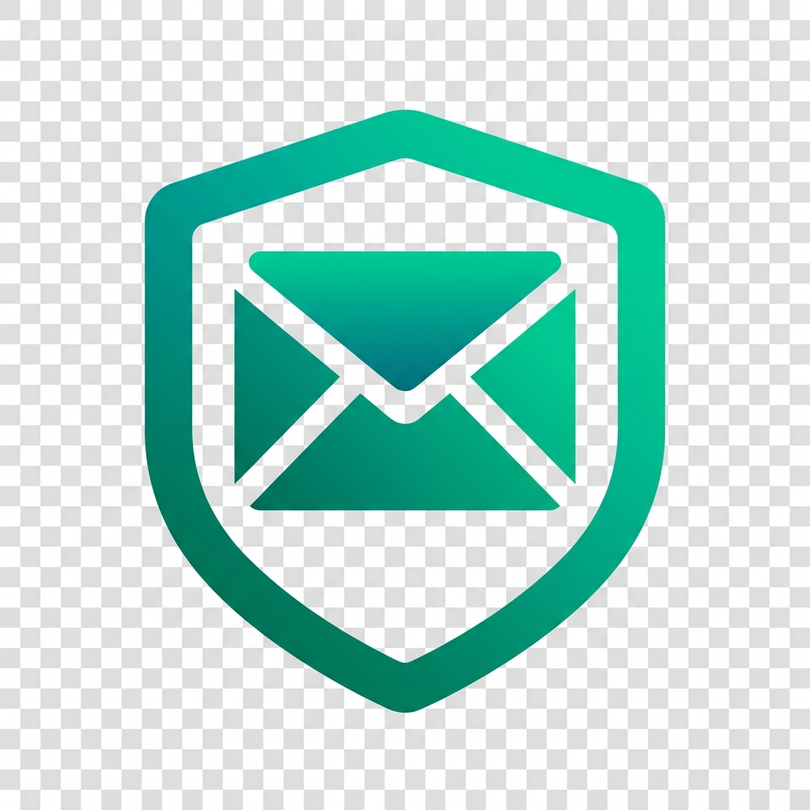
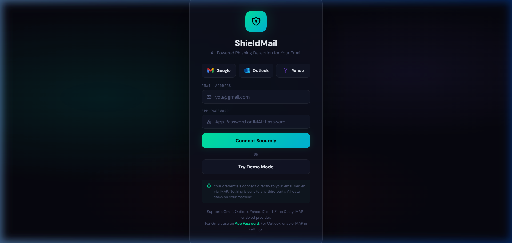
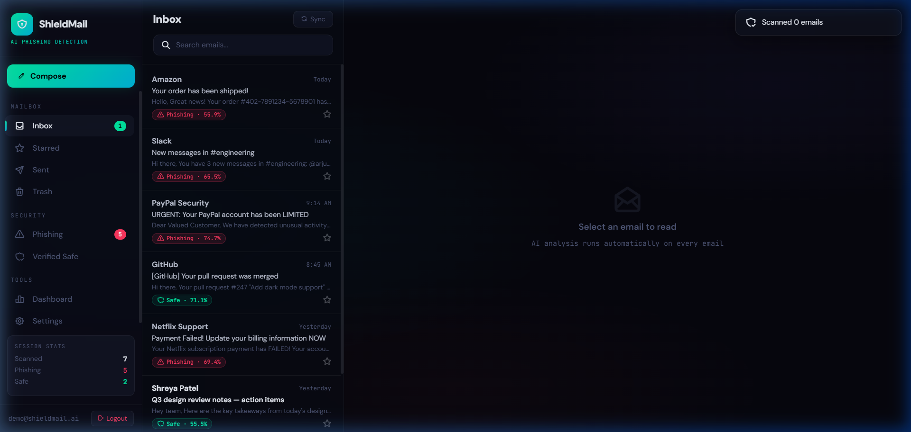

<div align="center">
  
  <h1>ShieldMail</h1>
  <p><strong>Privacy-first, multi-provider email client with local AI phishing detection.</strong></p>
</div>

<br />

ShieldMail is a desktop-focused email client that acts as a secure wrapper around your existing email accounts. Unlike cloud-based email clients, ShieldMail operates entirely locally—your credentials connect directly to your email provider (Gmail, Outlook, Yahoo) via IMAP, and your data never touches a third-party server.

Powered by a local `scikit-learn` machine-learning pipeline, ShieldMail automatically analyzes every incoming email for phishing threats, malicious URLs, and urgency indicators, keeping your inbox secure without compromising privacy.

## ✨ Features

- **🔒 Privacy-First Architecture**: Your emails and App Passwords never leave your machine.
- **🛡️ Local AI Phishing Detection**: Real-time ML scanning for phishing threats, calculating a granular risk score based on Flesch readability, HTML structure, and URL payload analysis.
- **🌍 Universal Provider Support**: Seamlessly connects to Gmail, Outlook, Yahoo, iCloud, Zoho, and other IMAP-enabled providers.
- **✉️ Native Email Experience**: Reply, compose, star, and trash emails directly from the sleek, glassmorphic UI.
- **🔑 2FA Verification Flow**: Built-in email-based 2FA to ensure secure login on local machines.
- **🚀 Background Syncing**: Silently downloads and analyzes thousands of emails in the background while keeping the UI blazing fast.

## 📸 Screenshots

### Secure Login & Provider Selection
<p align="center">
  
</p>

### AI-Secured Inbox & Threat Analysis
<p align="center">
  
</p>

## 🚀 Getting Started

### Prerequisites
- Python 3.9+
- A valid App Password for your email provider (Regular passwords are blocked by Google/Yahoo for IMAP).

### Installation

1. **Clone the repository:**
   ```bash
   git clone https://github.com/Cenizas036/shield-mail.git
   cd shield-mail
   ```

2. **Install the dependencies:**
   ```bash
   pip install -r requirements.txt
   ```

3. **Run the application:**
   ```bash
   python app.py
   ```

4. **Access the interface:**
   Open your browser and navigate to `http://localhost:5050`.

## 🛠️ Technology Stack
- **Backend:** Python, Flask, SQLite (for local caching), IMAP/SMTP (`imaplib`, `smtplib`)
- **Frontend:** Vanilla JavaScript, HTML5, CSS3 (Glassmorphism & BEM methodology)
- **Machine Learning:** `scikit-learn` (Random Forest pipeline), custom feature extraction heuristics
- **Icons:** Tabler Icons

## 🔒 Security & Privacy Notice
ShieldMail stores your App Passwords in a local, unencrypted SQLite database (`settings.db`) solely for the purpose of maintaining an active session on your machine. Ensure your local machine is secure. No telemetry, tracking, or external API calls are made.

Hosted at : https://shield-mail.vercel.app/
---
<div align="center">
  <i>Built to keep your inbox yours.</i>
</div>
